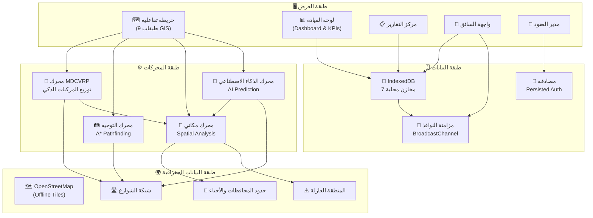
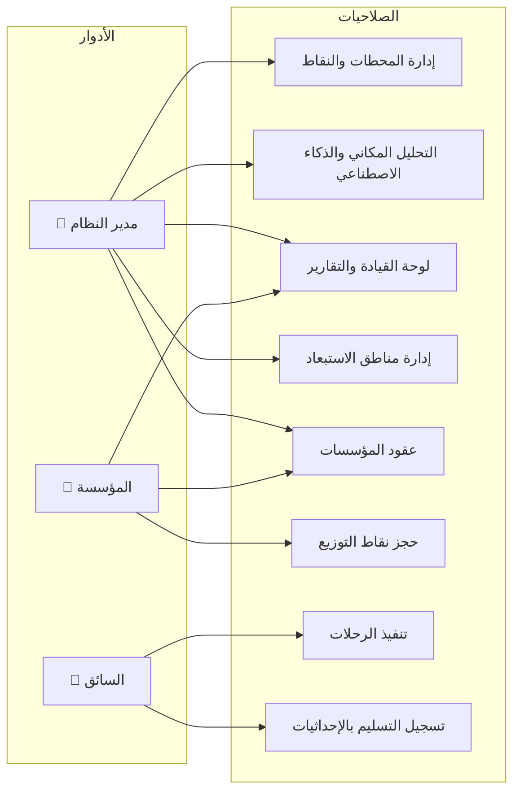
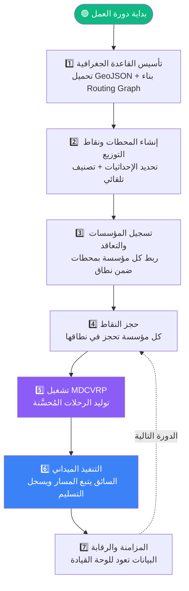

# WaterSync — منصة الذكاء المكاني لإدارة توزيع المياه في الأزمات

---

## لماذا هذا النظام؟

في قطاع غزة، تُعاني عمليات توزيع المياه من مشاكل حرجة تُهدر الموارد الشحيحة وتَحرم مناطق بأكملها من حقها في المياه. عدة جهات إغاثية تضخ المياه لنفس الحي، بينما أحياء مجاورة محرومة بالكامل. لا يوجد نظام موحد يُجيب بدقة: **"مَن استلم المياه؟ متى؟ وأين بالضبط؟"** — والسائقون يعتمدون على البحث اليدوي العشوائي للوصول، مما يستهلك وقوداً ووقتاً في ظل شُحّ الموارد. وفوق ذلك، شبكات الإنترنت في الميدان غير مستقرة أو منهارة كلياً.

**WaterSync** جاء ليحل هذه المشاكل برمجياً، عبر توظيف نظم المعلومات الجغرافية (GIS) في العرض والتحليل، والذكاء الاصطناعي (AI) في التوزيع والتنبؤ، وبنية بيانات تعمل بدون إنترنت أصلاً.

---

## كيف يعمل النظام على أرض الواقع؟

لفهم آلية عمل النظام، يجب أن نوضح أنه مبني على **ثلاثة أدوار رئيسية** تتكامل برمجياً: **مدير النظام**، **الجهات الإغاثية**، و**السائق**.

---

### أولاً: واجهة مدير النظام

لو بدأنا بواجهة مدير النظام، سنجد أننا قمنا أولاً بمعايرة **طبقات الأساس الجغرافية** لقطاع غزة (الأحياء، المحافظات، الشوارع). هذه الطبقات تُحمّل من ملفات GeoJSON ويُبنى منها رسم بياني حقيقي (Graph) لشبكة الشوارع — أي أن كل تقاطع يصبح عقدة، وكل قطعة شارع تصبح حافة بوزن يساوي المسافة الجغرافية الحقيقية (محسوبة بمعادلة هافرساين).

ولتسهيل إدارة هذه البيانات، بنينا **محرراً تفاعلياً** يشمل: الإضافة، والتعديل، والحذف، وكل ذلك بمرونة وسرعة عبر خاصية السحب والإفلات. ولتسهيل العمل أكثر، يغنينا **زر البحث عبر خريطة OSM** عن البحث اليدوي المعقد عن الإحداثيات؛ حيث يكفي إدخال اسم المكان ليحدد النظام المواقع المتوقعة مع خيار اعتمادها. وبهذه الطريقة تحديداً، قمت بإدخال البيانات الأساسية للمشافي وبعض المدارس.

يعتمد النظام على حفظ الإحداثيات وإدخال المعلومات الأساسية بدقة؛ كنوع النقطة، واسمها، وعدد المستفيدين منها. عند إضافة أي نقطة أو محطة على الخريطة، يُحدد النظام تلقائياً المحافظة والحي الذي تنتمي إليه عبر خوارزمية **Point-in-Polygon** — بمعنى أنه لا يحتاج المستخدم لتحديد هذه المعلومات يدوياً. ولتوفير الوقت، يمكن تجهيز بيانات مسبقاً واستيرادها دفعة واحدة عبر زر الاستيراد.

كما يوفر النظام ميزة بالغة الأهمية، وهي إمكانية تحديد **"مناطق الاستبعاد والخطر"** (كالشوارع المغلقة، أو المهددة بالقصف، أو التي لم يُزل ركامها بعد). هذه المناطق يمكن رسمها بأشكال متعددة (دائرية، مستطيلة، مضلعات حرة، أو على مسار شارع)، ويقوم النظام برمجياً باستبعادها من جميع المسارات والحسابات. تقنياً، يتم ذلك بإضافة **عقوبة مسافة (100 كم)** على أي حافة في الرسم البياني تمر عبر منطقة خطر، فيختار المحرك مسارات بديلة آمنة تلقائياً. وهناك أيضاً **المنطقة العازلة (Yellow Line)** وهي منطقة صلبة مُحمّلة من ملف GeoJSON تُستبعد نهائياً من التوزيع والتحليل.

#### التحليل المكاني والذكاء الاصطناعي

أيضاً من هذه الواجهة، تقوم **خوارزميات الذكاء الاصطناعي** بعمل تحليلات متقدمة:

- **تحليل الكثافة السكانية:** لكل نقطة، يُحسب عدد النقاط المحيطة بها ضمن نطاق 3 كم كمقياس لكثافة الاحتياج.
- **دوائر تغطية المحطات:** تحديد نقاط الطلب التي تبعد أكثر من 3 كم عن أقرب محطة وتقع خارج المنطقة العازلة — هذه هي **المناطق ناقصة الخدمة**.
- **التحليل المكاني لمناطق الوصول:** خريطة **9 طبقات متراكبة** تعرض الموقف الميداني بنظرة واحدة، مع **تلوين ديناميكي** للأحياء (أخضر = مغطاة، أصفر = جزئية، أحمر = محرومة).
- **معدلات الاستهلاك** ومؤشرات الأداء الرئيسية في لوحة القيادة (Dashboard).

فالنظام يولد تلقائياً **اقتراحات بالأماكن الأكثر حرجاً**، بل ويحدد جغرافياً **أفضل المواقع لإنشاء محطات تحلية جديدة** عبر خط معالجة ذكي:

1. تصفية النقاط ناقصة الخدمة (بُعد > 3 كم عن أقرب محطة)
2. تحليل كثافة الاحتياج المحيط
3. انتقاء أعلى **3 مواقع كثافة** بشرط أن تبعد عن بعضها **3 كم على الأقل** لضمان التوزع الجغرافي
4. إسقاط الإحداثيات المقترحة على **أقرب شارع حقيقي** (Street Snapping)
5. رفض أي موقع يقع خارج حدود الأحياء المعترف بها
6. عرض الموقع المقترح على الخريطة ليعتمده المشرف بنقرة واحدة

بدلاً من اعتماد الخبرة الشخصية أو التقديرات العشوائية، يُقدّم النظام توصيات مبنية على بيانات مكانية حقيقية.

---

### ثانياً: واجهة الجهات الإغاثية (المؤسسات)

أما بالنسبة للجهات الإغاثية، فهي تسجل بحساب منفصل تماماً لا تتداخل بياناته مع الجهات الأخرى. فكما تبيّن لي في مرحلة البحث، تعمل هذه المنظمات كوسيط بين الجهة الداعمة وعملية التوزيع الميدانية؛ فهي تتعاقد مع محطات المياه لتوزيعها عبر شاحنات المؤسسة أو شاحنات المحطة ذاتها، ثم تحدد مناطق التوزيع ذات الأولوية.

#### المشكلة التي يحلها النظام هنا

بعد إبرام التعاقدات، تنعدم المزامنة التي تمنع الازدواجية، وتغيب الجدولة المنظمة لمناطق التوزيع. فالأصل هو فحص وتحقق الاحتياج الفعلي قبل التوجه للمكان، بدلاً من الاعتماد على البحث الميداني العشوائي.

#### الحل العملي

بعد إتمام تسجيل التعاقدات (تحديد المحطة وعدد الشاحنات وسعاتها)، يُحدّث النظام سعة المحطة تلقائياً ويُقيّد نطاق المؤسسة بمحافظات محطاتها المتعاقدة. ثم تبدأ المرحلة الأهم:

**تُجدوَل الشاحنات لتغطية المناطق بأنسب الطرق التي تحقق العدالة والشمولية وفقاً للموارد المتاحة.**

تقنياً، يحدث ذلك عبر **محرك MDCVRP** (مسألة توجيه المركبات متعددة المحطات ومحدودة السعة — وهي مسألة NP-Hard في علوم الحاسوب). هذا المحرك يُجيب عن السؤال الجوهري: **"أي شاحنة تذهب لأي نقطة، ومن أي محطة، وبأي ترتيب، وكم تحمل؟"**

خط المعالجة:
1. **الربط المكاني:** ربط كل نقطة طلب بأقرب محطة ضمن نطاق تغطية 3 كم
2. **توزيع الحمولات (Bin Packing):** تعبئة كل شاحنة بأقصى حمولة ممكنة دون تجاوز سعتها
3. **ترتيب التوقفات:** خوارزمية الجار الأقرب (Nearest Neighbor) كحل أولي، ثم تحسينه بخوارزمية **التبديل الثنائي (2-opt)** للحصول على أقصر مسار
4. **أولوية المستشفيات:** إعطاء **أولوية قصوى للمرافق الحساسة كأقسام الكلى في المشافي** بتخصيص رحلة مستقلة لكل مستشفى
5. **حساب المسارات الفعلية:** استدعاء محرك التوجيه (**A\* Pathfinding**) لرسم المسار الواقعي عبر شبكة الشوارع — لا خطوط مستقيمة، بل شوارع حقيقية يمكن للسائق اتباعها

فيتم رسم أقصر المسارات الممكنة، وعرضها في **جداول منظمة**، مع إمكانية **محاكاة خط سيرها** بصرياً. وتُعرض هذه البيانات لكل مؤسسة عبر واجهتها الخاصة **دون أي تداخل** مع المؤسسات الأخرى.

#### العدالة مع المرونة

يُركز النظام على **مناطق العجز بالدرجة الأولى**، مع احترام **"المناطق المحجوزة مسبقاً"** — فإذا رغبت مؤسسة في تثبيت التوزيع لمنطقة معينة، يتيح لها النظام ذلك. نظام الحجز يمنع تقنياً أن تحجز مؤسستان نفس النقطة (Zero-Overlap)، ويمر الحجز بدورة حياة كاملة:

> **متاح → محجوز → قيد النقل → تم التسليم → تم التحقق**

هذا يعني أن الهدف العام للمشروع لا يتعارض مع توجهات المؤسسات، بل يوفر لها المرونة اللازمة، مستغلاً في ذلك التكنولوجيا المتاحة؛ كتقنيات GIS في العرض، والذكاء الاصطناعي في التحليل والتوزيع.

#### مخرجات المؤسسة

هذه المخرجات تظهر للمؤسسة بطريقتين:

1. **جداول تفصيلية** توضح اللترات، والرحلات، ونقاط الانطلاق والوصول، مع **تقرير عجز** يُحصي النقاط التي تعذر خدمتها مع أسباب الفشل.
2. **عرض بصري على الخريطة** حيث تُرسم خطوط السير بخوارزمية "أقصر مسار" لتقليل هدر الوقود والوقت. الخريطة التفاعلية تكشف **نسب وصول المياه**؛ فتظهر الأحياء المغطاة باللون الأخضر، والمهمشة باللون الأحمر، ليعكس حالة العجز. مع إتاحة **محاكاة خط السير** قبل اعتماده — موفراً بذلك مؤشراً مكانياً يلفت الانتباه للتحليل.

---

### ثالثاً: واجهة السائق

أخيراً: واجهة السائق **مبسطة جداً** ولا تحتاج إلا لتسجيل سريع، ثم إدراج اسم الجهة المشغلة لتقوم باعتماده. بعدها يصبح السائق قادراً على عرض رحلاته المعتمدة و**محاكاة خط سيرها بصرياً** على الخريطة.

أهم خيار هنا هو تسجيل وتوثيق وصول المياه عبر تفعيل **"البصمة الزمانية الجغرافية"** (GeoTimestamp)؛ أي أن يفتح السائق هاتفه ويفعّل الـ GPS لتلتقط المنصة **الوقت والإحداثيات بدقة** عند التفريغ.

تقنياً، كل عملية تسليم تُسجّل بتسعة حقول بيانية: الرحلة، النقطة، المؤسسة، السائق، المحطة، الكمية، حالة التسليم، الإحداثيات عند التحميل/التفريغ، والختم الزمني.

ولضمان استمرارية العمل عند انقطاع الإنترنت، يحتفظ النظام بالبيانات محلياً في **IndexedDB** لتتم **المزامنة تلقائياً** فور عودة الإشارة — في خطوة تزيد بشكل كبير من **الشفافية والموثوقية** لدى المانحين.

وتُسجل الكمية المُسلمة في مخرجات **التقارير النهائية** كبيانات دقيقة **قابلة للتصدير**.

---

## البنية التقنية التي تقف خلف كل ذلك

### طبقات النظام

بُني النظام على **أربع طبقات** مترابطة تعمل بالكامل داخل متصفح المستخدم:

### قاعدة البيانات المحلية

النظام يستخدم **IndexedDB** (قاعدة بيانات مدمجة في المتصفح بسعة تتجاوز 250MB) تحتوي على **7 مخازن**:

| المخزن | ماذا يحفظ |
|--------|-----------|
| **stations** | محطات تعبئة المياه (الموقع، السعة، المؤسسات المتعاقدة) |
| **points** | نقاط التوزيع (الموقع، النوع، الاحتياج، حالة الحجز) |
| **trips** | الرحلات والمسارات المحسوبة خوارزمياً |
| **zones** | مناطق الاستبعاد والخطر |
| **executions** | تنفيذ الجولات الميدانية |
| **history** | سجل عمليات التوصيل التاريخي |
| **deliveries** | سجلات التسليم التفصيلية (GPS + Timestamp) |

### آليات المزامنة

النظام يعمل بثلاث آليات مزامنة تضمن استمرارية العمل:

- **بين النوافذ:** مزامنة فورية عبر **BroadcastChannel API** — عند تعديل أي بيانات في نافذة، يصل التحديث لجميع النوافذ الأخرى خلال أجزاء من الثانية.
- **بدون إنترنت (Offline-First):** جميع البيانات تُحفظ محلياً أولاً، ثم تُزامن تلقائياً عند عودة الاتصال.
- **استمرارية الجلسة:** بيانات المصادقة تُحفظ في localStorage عبر Zustand Persist Middleware — لا حاجة لإعادة تسجيل الدخول.

---

## الخوارزميات والمحركات بالتفصيل

### محرك التوجيه — A* Pathfinding

هذا المحرك يحسب **المسارات الواقعية** على شبكة الشوارع الفعلية. يُحوّل بيانات الشوارع (GeoJSON LineStrings) إلى رسم بياني مرجح، ثم يستخدم خوارزمية **A\*** لإيجاد أقصر مسار. إذا مر المسار بمنطقة خطر، يُضاف عقوبة 100 كم فيختار بديلاً آمناً. وإذا تعذّر إيجاد أي مسار عبر الشوارع، يعود تلقائياً للخط المستقيم كحل احتياطي.

ميزة مهمة: **الالتقاط على الشارع (Snap-to-Street)** — أي إحداثية عشوائية تُسقط على أقرب مقطع شارع حقيقي لضمان واقعية المسارات.

### محرك التوزيع الذكي — MDCVRP

شرحته أعلاه في سياق واجهة المؤسسات. باختصار، يحل مسألة NP-Hard في توزيع الشاحنات المتعددة على النقاط بأمثل طريقة ممكنة، مع مراعاة السعات والأولويات والمسافات.

### محرك التنبؤ بالذكاء الاصطناعي

شرحته في سياق واجهة المدير. يحدد أفضل المواقع لإنشاء محطات جديدة بتحليل مكاني متعدد المعايير (Multi-Criteria Spatial Analysis) يجمع بين تحليل الكثافة والقيود المكانية.

### الأدوات المكانية (Spatial Utilities)

مجموعة أدوات تخدم جميع المحركات:
- **Point-in-Polygon:** هل هذه النقطة داخل هذا الحي؟ (عبر Turf.js وخوارزمية Ray Casting)
- **التصنيف الجغرافي التلقائي:** لكل نقطة تُضاف، تُحدد المحافظة والحي تلقائياً
- **فحص مناطق الاستبعاد:** التحقق من وقوع نقاط أو مسارات في مناطق خطر

---

## نظام الأدوار والصلاحيات

| الدور | وصفه | ماذا يفعل |
|-------|------|-----------|
| **مدير النظام** | المشرف العام ذو الرؤية الشاملة | إدارة المحطات والنقاط، تشغيل الخوارزميات، التحليل المكاني، لوحة القيادة، إدارة مناطق الاستبعاد |
| **المؤسسة** | الجهة التشغيلية التي تملك شاحنات وتتعاقد مع المحطات | حجز النقاط، إدارة العقود، الاطلاع على التقارير الخاصة بها |
| **السائق** | المنفذ الميداني | تنفيذ الرحلات المُسندة، تسجيل التحميل/التفريغ بالإحداثيات والتوقيت |

---

## دورة حياة البيانات الكاملة

---

## حزمة التقنيات

### التقنيات الأساسية

| التقنية | لماذا استخدمتها |
|---------|-----------------|
| **React 19** | إطار واجهات المستخدم الأكثر نضجاً. يُتيح بناء واجهات تفاعلية تتجاوب لحظياً مع التغيرات في البيانات الجغرافية عبر Virtual DOM |
| **TypeScript 5.9** | يفرض أنماط بيانات صارمة على كل النماذج (Station, Point, Trip, DeliveryRecord) — ضروري عند التعامل مع إحداثيات GPS وحسابات خوارزمية دقيقة |
| **Vite 7** | أسرع أداة بناء حالياً، يدعم تحديثاً لحظياً أثناء التطوير ويُنتج حزمة إنتاج خفيفة قابلة للنشر كـ PWA |

### الخرائط والتحليل المكاني

| التقنية | لماذا استخدمتها |
|---------|-----------------|
| **Leaflet + React-Leaflet** | محرك خرائط خفيف (~42KB) مع دعم كامل للطبقات التسع والبلاط المحلي (Offline Tiles). خفته تجعله مثالياً لبيئات ضعيفة الاتصال |
| **Turf.js** | مكتبة تحليل مكاني تعمل بالكامل داخل المتصفح (Point-in-Polygon، قياس المسافات، تحليل الكثافة) بدون أي خادم خارجي |
| **GeoJSON** | المعيار المفتوح (RFC 7946) لتمثيل البيانات الجغرافية، متوافق مع كل أدوات GIS |

### إدارة الحالة والبيانات

| التقنية | لماذا استخدمتها |
|---------|-----------------|
| **Zustand** | مكتبة إدارة حالة خفيفة (~1KB) تدعم التقسيم والاشتراك الجزئي — تمنع إعادة العرض غير الضرورية في خريطة معقدة بتسع طبقات |
| **IndexedDB** | قاعدة بيانات مدمجة في المتصفح (>250MB) تعمل بدون إنترنت — الخيار الأمثل لتخزين آلاف السجلات الجغرافية محلياً |
| **BroadcastChannel API** | مزامنة فورية بين النوافذ بدون أي خادم وسيط |

### واجهة المستخدم والرسوم البيانية

| التقنية | لماذا استخدمتها |
|---------|-----------------|
| **TailwindCSS** | تصميم واجهات احترافية بسرعة مع دعم كامل للوضع المظلم والتصميم المتجاوب |
| **Chart.js** | رسوم بيانية تفاعلية لعرض إحصائيات التوزيع في لوحة القيادة |
| **Lucide React** | أيقونات SVG حديثة ومتسقة التصميم |
| **React Router** | توجيه قائم على المسارات لتمكين الروابط المباشرة |

---

## بنية الكود

بُني النظام بمنهجية **فصل المسؤوليات** على خمس طبقات:

**1. المكونات المرئية** — مُقسّمة إلى 10 مجموعات:

| المجموعة | ماذا تحتوي |
|----------|------------|
| `map/` | 14 مكوناً للخريطة: الطبقات التسع + معالج النقر + أدوات التحليل |
| `sidebar/` | اللوحة الجانبية: العرض، الطلب، الرحلات، القيود |
| `driver/` | واجهة السائق: عرض الرحلة، تسجيل التسليم، تأكيد الاستلام |
| `reports/` | التقارير المالية والتشغيلية |
| `editor/` | محرر البيانات (إضافة/تعديل المحطات والنقاط) |
| `auth/` | المصادقة: تسجيل الدخول + تسجيل المؤسسات + تسجيل السائقين |
| `onboarding/` | معالج تسجيل المؤسسات خطوة بخطوة |
| `toolbar/` | شريط الأدوات والتنقل |
| `panels/` | اللوحات المساعدة |
| `ui/` | مكونات واجهة مشتركة |

**2. المحركات الخوارزمية** — كود خوارزمي بحت (Pure Functions) منفصل عن الواجهة:
- `mdcvrp.ts` — حل مسألة التوزيع الذكي
- `routing.ts` — بناء الرسم البياني + A* Pathfinding
- `exclusionZones.ts` — فحص مناطق الاستبعاد

**3. الأدوات المكانية** — تحديد الموقع الجغرافي والبحث عن المحافظات والأحياء

**4. المخازن (Stores)** — مُقسمة إلى:
- **CoreSlice:** المحطات، النقاط، الرحلات، مناطق الاستبعاد + عمليات CRUD
- **ReservationSlice:** نظام حجز النقاط بدورة حياة كاملة
- **SyncSlice:** سجلات التسليم + محرك المزامنة
- مخازن مستقلة: `AuthStore`، `MapStore`، `UIStore`، `SimulationStore`

**5. الخدمات** — `DataLoaderService` لتحميل البيانات الجغرافية، و`NotificationRulesEngine` لنظام الإشعارات الذكي، و`EventBus` كناقل أحداث مركزي

---

## مبادئ التصميم الهندسي

| المبدأ | كيف طبقته |
|--------|-----------|
| **Offline-First** | كل شيء يعمل بدون إنترنت أولاً، والمزامنة تحدث لاحقاً |
| **Spatial-First** | كل كيان له إحداثيات، وكل قرار مبني على التحليل المكاني |
| **Role-Based** | كل واجهة ووظيفة مقيدة بدور المستخدم |
| **Event-Driven** | نظام أحداث مركزي ينقل الأحداث بدون اقتران مباشر |
| **Zero-Overlap** | النظام يمنع تقنياً أي تداخل بين المؤسسات |
| **Pure Engine** | المحركات الخوارزمية منفصلة تماماً عن الواجهة |

---

وكل ذلك يضمن لنا إدارة الأزمة وتوزيع المياه **استناداً إلى دقة المعلومة وسرعة الاستجابة**، لا على العشوائية. **WaterSync** لا يكتفي بأتمتة العمليات — بل يُعيد هندسة كيفية وصول المياه لمستحقيها عبر **الذكاء المكاني** و**الخوارزميات التنبؤية** لبناء منظومة عادلة، شفافة، وقادرة على العمل في أصعب الظروف الميدانية.
