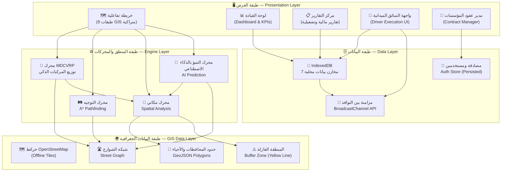
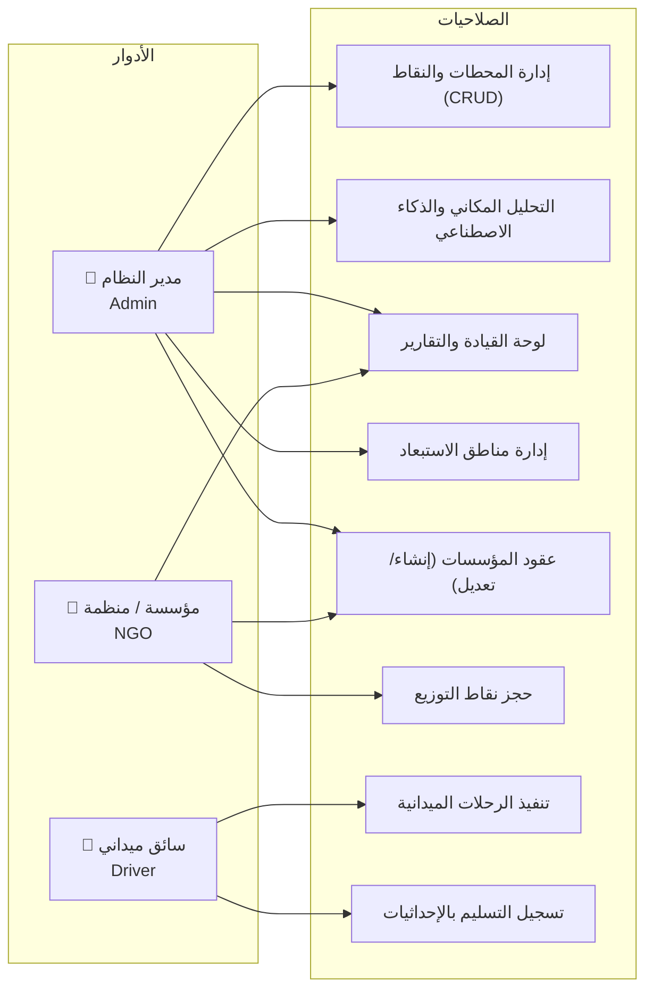
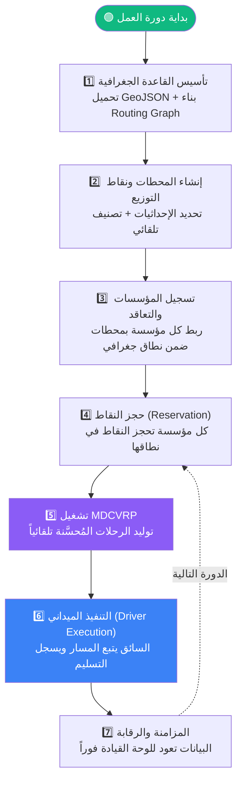

# WaterSync — وثيقة هندسة النظام وسير العمليات

### System Architecture & Workflow Document

---

## 1. الملخص والأهداف العملية (Executive Summary & Objectives)

### 1.1 المشكلة

في مناطق الأزمات والطوارئ، وتحديداً في قطاع غزة، تُعاني عمليات توزيع المياه من **تحديات حرجة** تُهدر الموارد الشحيحة وتَحرم فئات ومناطق كاملة من حقها الأساسي في الحصول على المياه. يمكن تلخيص أبرز هذه التحديات في النقاط التالية:

- **التداخل العشوائي بين المؤسسات الإغاثية:** عدة جهات ومؤسسات تضخ المياه لنفس الحي أو المخيم، بينما تبقى أحياء ومخيمات مجاورة محرومة بالكامل، مما يُشكّل إهداراً مزدوجاً: في الموارد المالية، وفي المياه ذاتها.
- **العمى المكاني (Spatial Blindness):** غياب منظومة موحدة تُجيب بدقة عن الأسئلة الرقابية الجوهرية: **"مَن استلم المياه؟ متى؟ وأين بالضبط؟"** — مما يُفقد المانحين والجهات الرقابية القدرة على التحقق من وصول المساعدات لمستحقيها.
- **المسارات العشوائية:** سائقو الصهاريج يعتمدون على الخبرة الشخصية والبحث اليدوي للوصول إلى الخزانات، مما يستهلك كميات كبيرة من الوقود والوقت في ظل شُحّ الموارد.
- **انقطاع البنية التحتية للاتصالات:** شبكات الإنترنت في مناطق التدخل الميداني غير مستقرة أو منهارة كلياً، مما يجعل أي نظام يعتمد على الاتصال المستمر بالخادم غير صالح للاستخدام الميداني.

### 1.2 الحل — WaterSync

**WaterSync** منصة ذكاء مكاني (Spatial Intelligence Platform) تُوظّف **نظم المعلومات الجغرافية (GIS)**، و**خوارزميات الذكاء الاصطناعي (AI)**، و**بنية بيانات تعمل بدون إنترنت (Offline-First Architecture)** لحل هذه المشكلات برمجياً عبر نهج هندسي متكامل.

### 1.3 الأهداف العملية

| # | الهدف | الوصف |
|---|-------|-------|
| 1 | **القضاء على التداخل المؤسسي** | منع أي مؤسستين من خدمة نفس النقطة الجغرافية عبر نظام حجز نقاط ذكي مبني على الإحداثيات |
| 2 | **عدالة التوزيع** | تحليل مكاني مستمر يكشف المناطق المحرومة ويعرضها بصرياً لصنّاع القرار فوق الخريطة التفاعلية |
| 3 | **خفض التكلفة التشغيلية** | تحسين مسارات الشاحنات خوارزمياً لتقليل المسافات المقطوعة واستهلاك الوقود |
| 4 | **شفافية وحوكمة** | سجلات رقمية لكل عملية تسليم بختم زمني (Timestamp) وإحداثيات GPS لا تقبل التلاعب |
| 5 | **استمرارية العمل الميداني** | ضمان عمل النظام بكامل وظائفه حتى في غياب الإنترنت، مع مزامنة تلقائية عند عودة الاتصال |
| 6 | **التوسع الاستراتيجي الذكي** | اقتراح مواقع محطات مياه جديدة بتحليل الذكاء الاصطناعي بناءً على كثافة الاحتياج الجغرافي |

### 1.4 الأثر الفعلي المتوقع

- **تحويل عمليات التوزيع** من نمط عشوائي ارتجالي إلى منظومة تقنية محكومة بخوارزميات مكانية.
- **تمكين الجهات المانحة** من التحقق (Audit) من وصول التمويل لمستحقيه عبر سجلات مكانية-زمنية شفافة.
- **تقليل الهدر** عبر منع التداخل خوارزمياً وتحسين كفاءة المسارات، مما يُوفّر موارد يمكن إعادة توجيهها لمناطق محرومة إضافية.

---

## 2. البنية المعمارية للنظام (System Architecture)

### 2.1 الرؤية العامة

بُني النظام على **أربع طبقات رئيسية** مترابطة، تعمل بالكامل داخل متصفح المستخدم (Client-Side Application) مع قدرات مزامنة متقدمة بين النوافذ وعبر الشبكة عند توفرها:

---

### 2.2 طبقة العرض (Presentation Layer)

تُقدّم هذه الطبقة **خمس واجهات رئيسية** يُتاح كلٌّ منها بناءً على دور المستخدم في النظام (Role-Based UI):

| الواجهة | الوصف الوظيفي | الأدوار المخولة |
|---------|---------------|-----------------|
| **الخريطة التفاعلية** | خريطة GIS بتسع طبقات متراكبة: محطات المياه، نقاط التوزيع، المسارات المحسوبة، حدود المحافظات، حدود الأحياء، شبكة الشوارع، مناطق الاستبعاد (خطر)، المنطقة العازلة (Yellow Line)، طبقة التحليل المكاني الذكي | الجميع |
| **لوحة القيادة (Dashboard)** | رسوم بيانية تفاعلية ومؤشرات أداء رئيسية (KPIs): تغطية المحطات، إحصائيات التوزيع اليومية، أداء المؤسسات، ومعدلات الإنجاز | مدير النظام |
| **مركز التقارير** | تقارير مالية وتشغيلية مفصلة تُستخرج من سجلات التسليم الميدانية | مدير النظام، المؤسسة |
| **واجهة السائق الميدانية** | عرض المهام المُسندة (Trip Stops)، والمسار المحسوب على الخريطة، وتسجيل عمليات التحميل والتفريغ بدقة الإحداثيات والتوقيت، مع إمكانية العمل دون إنترنت | السائق |
| **مدير عقود المؤسسات** | إنشاء وإدارة عقود المؤسسات الإغاثية مع محطات المياه، وتحديد عدد الشاحنات المخصصة وسعات التشغيل ضمن حيز جغرافي محدد | مدير النظام، المؤسسة |

---

### 2.3 طبقة المنطق والمحركات (Engine Layer)

هذه هي **النواة الحسابية للنظام** — أربعة محركات خوارزمية تعمل بالتنسيق لتحويل البيانات الجغرافية الخام إلى قرارات تشغيلية ذكية:

#### أ. محرك التوزيع الذكي — MDCVRP Solver

> **MDCVRP = Multi-Depot Capacitated Vehicle Routing Problem**
> مسألة توجيه المركبات متعددة المحطات ومحدودة السعة — وهي مسألة NP-Hard في علوم الحاسوب.

هذا المحرك يُجيب عن السؤال التشغيلي الجوهري: **"أي شاحنة تذهب لأي نقطة، ومن أي محطة، وبأي ترتيب، وكم تحمل؟"**

- **المدخلات:** محطات المياه (بسعاتها المتبقية وعدد شاحناتها)، نقاط الطلب (باحتياجاتها وتصنيفاتها وأولوياتها)، مناطق الاستبعاد النشطة، شبكة الشوارع الحقيقية.
- **المعالجة (Pipeline):**
  1. **الربط المكاني (Spatial Association):** ربط كل نقطة طلب بأقرب محطة مياه ضمن **نطاق تغطية 3 كم**، مع استبعاد النقاط الواقعة داخل **المنطقة العازلة (Yellow Line)**.
  2. **توزيع الحمولات (Bin Packing):** تعبئة كل شاحنة بأقصى حمولة ممكنة مع مراعاة **سعتها القصوى** وعدم تجاوزها.
  3. **ترتيب التوقفات (Route Sequencing):** تطبيق **خوارزمية الجار الأقرب (Nearest Neighbor Heuristic)** كحل أولي، ثم تحسينه بخوارزمية **التبديل الثنائي (2-opt Local Search)** للحصول على أقصر مسار.
  4. **أولوية المستشفيات:** إعطاء **أولوية قصوى للمستشفيات والمنشآت الحيوية** بتخصيص رحلة مستقلة مخصصة لكل مستشفى.
  5. **حساب المسارات الفعلية:** استدعاء محرك التوجيه (A*) لرسم المسار الواقعي عبر شبكة الشوارع بدلاً من الخطوط المستقيمة.
- **المخرجات:** مجموعة رحلات (Trips) مُحسَّنة، كل رحلة تحتوي: المحطة المصدر، ترتيب التوقفات، المسار الجغرافي الكامل، الكميات المطلوبة لكل نقطة، **وتقرير عجز (Deficit Report)** يُحصي النقاط التي تعذر خدمتها مع أسباب الفشل.

#### ب. محرك التوجيه — A* Pathfinding Engine

يُوفّر هذا المحرك القدرة على حساب المسارات الواقعية على شبكة الشوارع الفعلية:

- **بناء الرسم البياني (Graph Construction):** يُحوّل بيانات شبكة الشوارع (GeoJSON LineStrings) إلى **رسم بياني مرجح (Weighted Graph)**، حيث كل تقاطع = عقدة (Node)، وكل قطعة شارع = حافة (Edge) بوزن يساوي المسافة الجغرافية الحقيقية.
- **حساب المسافات:** يعتمد **معادلة هافرساين (Haversine Formula)** لحساب المسافات الكروية الدقيقة بين الإحداثيات.
- **خوارزمية إيجاد المسار (A* Algorithm):** تجد أقصر مسار بين نقطتين على الشبكة مع:
  - **تجنب مناطق الخطر:** إضافة **عقوبة مسافة (Penalty = 100 كم)** على أي حافة تمر عبر منطقة استبعاد نشطة، مما يُوجّه الخوارزمية لاختيار مسارات بديلة آمنة.
  - **الالتقاط على الشارع (Snap-to-Street):** إسقاط أي إحداثية عشوائية (محطة أو نقطة) على أقرب مقطع شارع حقيقي لضمان واقعية المسارات المحسوبة.
  - **التراجع الذكي (Fallback):** العودة تلقائياً للخط المستقيم (Euclidean Distance) إذا تعذّر إيجاد مسار عبر شبكة الشوارع.

#### ج. المحرك المكاني (Spatial Utilities)

مجموعة من الأدوات التحليلية المكانية التي تخدم جميع المحركات الأخرى:

- **Point-in-Polygon:** تحديد هل نقطة ما تقع داخل مضلع جغرافي (محافظة، حي، منطقة عازلة) باستخدام مكتبة **Turf.js** وخوارزمية **Ray Casting**.
- **التصنيف الجغرافي التلقائي:** لكل نقطة أو محطة تُضاف على الخريطة، يتم تحديد المحافظة والحي تلقائياً دون تدخل المستخدم.
- **فحص مناطق الاستبعاد:** التحقق من وقوع نقاط أو مسارات داخل مناطق خطر بأشكال متعددة (دائرية، مستطيلة، مضلعات حرة، مسارات شارع).

#### د. محرك التنبؤ بالذكاء الاصطناعي (AI Prediction Engine)

يُحدد **أفضل المواقع الاستراتيجية لإنشاء محطات مياه جديدة** بناءً على تحليل مكاني متعدد المعايير:

1. **تحديد المناطق الناقصة الخدمة (Underserved Area Detection):** تصفية نقاط الطلب التي تبعد أكثر من 3 كم عن أقرب محطة وتقع خارج المنطقة العازلة.
2. **تحليل كثافة الاحتياج (Demand Density Analysis):** لكل نقطة ناقصة الخدمة، يُحسب عدد النقاط المحيطة بها ضمن نطاق 3 كم كمقياس لكثافة الاحتياج.
3. **اختيار مراكز القرار (Centroid Selection):** انتقاء أعلى **3 مواقع كثافة** بشرط أن تبعد عن بعضها **3 كم على الأقل**، لضمان التوزع الجغرافي وعدم التجمع.
4. **المحاذاة مع الواقع (Street Snapping + Neighborhood Validation):** إسقاط الإحداثيات المقترحة على أقرب شارع حقيقي، مع **رفض أي موقع يقع خارج حدود الأحياء المعترف بها** في قاعدة البيانات الجغرافية.
5. **الاعتماد التفاعلي:** يمكن للمشرف معاينة الموقع المقترح مباشرة على الخريطة بنقرة واحدة، وتحويله إلى محطة فعلية عند الموافقة.

---

### 2.4 طبقة البيانات (Data Layer)

#### قاعدة البيانات المحلية (IndexedDB)

النظام يستخدم **قاعدة بيانات مدمجة في المتصفح** (IndexedDB) تحتوي على **7 مخازن بيانات (Object Stores)**:

| المخزن | المحتوى | الفهارس |
|--------|---------|---------|
| **stations** | محطات تعبئة المياه (الموقع، السعة، المؤسسات المتعاقدة) | — |
| **points** | نقاط التوزيع/الطلب (الموقع، النوع، الاحتياج، الحالة، الحجز) | — |
| **trips** | الرحلات والمسارات المحسوبة خوارزمياً | — |
| **zones** | مناطق الاستبعاد/الخطر (متعددة الأشكال) | — |
| **executions** | تنفيذ الجولات الميدانية اليومية | [date](file:///d:/%D8%A3%D9%86%D8%B3/%D9%85%D8%B4%D8%A7%D8%B1%D9%8A%D8%B9%2026/%D9%8A%D8%AC%D8%B1%D9%8A%20%D8%A7%D9%84%D8%A7%D9%86/GIS%20-%20IUG%20-%20WaterSync/WaterSync/WaterSync_Latest_React/src/stores/useAuthStore.ts#208-210), `tripId` |
| **history** | سجل عمليات التوصيل التاريخي | [date](file:///d:/%D8%A3%D9%86%D8%B3/%D9%85%D8%B4%D8%A7%D8%B1%D9%8A%D8%B9%2026/%D9%8A%D8%AC%D8%B1%D9%8A%20%D8%A7%D9%84%D8%A7%D9%86/GIS%20-%20IUG%20-%20WaterSync/WaterSync/WaterSync_Latest_React/src/stores/useAuthStore.ts#208-210), `pointId` |
| **deliveries** | سجلات التسليم الميدانية التفصيلية (GPS + Timestamp) | `pointId`, `institutionId` |

#### نظام المزامنة (Sync Architecture)

يعمل النظام بثلاث آليات مزامنة متكاملة:

- **المزامنة بين النوافذ (Cross-Tab Sync):** مزامنة فورية بين جميع نوافذ المتصفح المفتوحة عبر **BroadcastChannel API** — عند تعديل أي بيانات في نافذة (مثلاً: حجز نقطة من مؤسسة)، يصل التحديث لجميع النوافذ الأخرى خلال أجزاء من الثانية، مما يمنع التضارب في عمليات الحجز.
- **البنية بدون إنترنت (Offline-First):** جميع البيانات تُحفظ محلياً أولاً في IndexedDB، بما يضمن استمرار العمل الميداني بالكامل حتى في غياب الاتصال، ثم تتم مزامنتها تلقائياً عند عودة الإنترنت.
- **استمرارية الجلسة (Persistent Auth):** بيانات المصادقة تُحفظ في `localStorage` عبر Zustand Persist Middleware، مما يمنع إعادة تسجيل الدخول عند كل فتح للتطبيق.

---

### 2.5 البيانات الجغرافية (GIS Data Layer)

| مصدر البيانات | النوع | الاستخدام في النظام |
|---------------|-------|---------------------|
| **governorates.json** | حدود المحافظات (GeoJSON Polygons) | تحديد المحافظة لكل نقطة/محطة تلقائياً |
| **neighborhoods.json** | حدود الأحياء (GeoJSON Polygons) | تحديد الحي + تقييد اقتراحات الذكاء الاصطناعي ضمن أحياء معترف بها |
| **streets.json** | شبكة الشوارع (GeoJSON LineStrings) | بناء الرسم البياني (Graph) لمحرك التوجيه A* |
| **buffer_zone.json** | المنطقة العازلة (Yellow Line) | استبعاد المناطق الخطرة من التوزيع والتحليل |
| **Local Tiles** | خرائط OpenStreetMap محلية (Offline Raster Tiles) | عرض الخريطة الأساسية بدون أي حاجة للإنترنت |

---

### 2.6 نظام الأدوار والصلاحيات (Role-Based Access Control)

يعتمد النظام على ثلاثة أدوار رئيسية، كلٌّ منها بصلاحيات مُحددة تقنياً:

| الدور | الوصف | أبرز الصلاحيات |
|-------|-------|----------------|
| **مدير النظام (Admin)** | المشرف العام ذو الرؤية الشاملة (God View) لكافة بيانات النظام | إدارة كاملة للمحطات والنقاط، تشغيل الخوارزميات، التحليل المكاني، لوحة القيادة، إدارة مناطق الاستبعاد |
| **المؤسسة / المنظمة (NGO)** | الجهة التشغيلية التي تمتلك شاحنات وتتعاقد مع محطات ضمن نطاق جغرافي | حجز نقاط التوزيع، إدارة عقودها، الاطلاع على التقارير الخاصة بها |
| **السائق (Driver)** | المنفذ الميداني المسؤول عن إيصال المياه وتسجيل التسليم | تنفيذ الرحلات المُسندة، تسجيل التحميل/التفريغ بالإحداثيات والتوقيت |

---

## 3. دورة حياة ومعالجة البيانات (Data Flow & Lifecycle)

### 3.1 المسار الكامل: من التأسيس إلى التنفيذ

### 3.2 تفصيل مراحل دورة البيانات

#### المرحلة 1: تأسيس القاعدة الجغرافية

| العنصر | التفصيل |
|--------|---------|
| **المدخل** | ملفات GeoJSON جغرافية (محافظات، أحياء، شوارع، منطقة عازلة) |
| **المعالجة** | تحميل البيانات عند بدء التطبيق → بناء الرسم البياني (Graph) من شبكة الشوارع (تقاطعات + حواف) → إنشاء دوال البحث المكاني (Polygon Lookup Functions) |
| **المخرج** | نموذج جغرافي جاهز في الذاكرة للتحليل المكاني الفوري |

#### المرحلة 2: إنشاء المحطات ونقاط التوزيع

| العنصر | التفصيل |
|--------|---------|
| **المدخل** | المشرف ينقر على الخريطة لتحديد موقع محطة أو نقطة توزيع |
| **المعالجة** | النظام يُحدد المحافظة والحي تلقائياً (Point-in-Polygon) ← يُنشئ الكيان بالبيانات المكانية ← يحفظ في IndexedDB ← يبث التحديث لجميع النوافذ عبر BroadcastChannel |
| **المخرج** | بيانات جغرافية مصنّفة ومخزّنة محلياً، معروضة فوراً على الخريطة في جميع النوافذ |

#### المرحلة 3: التعاقد الجغرافي الذكي

| العنصر | التفصيل |
|--------|---------|
| **المدخل** | المؤسسة تُسجّل في النظام وتختار المحطة التي ستتعاقد معها، وتحدد عدد الشاحنات |
| **المعالجة** | النظام يُحدث سعة المحطة تلقائياً (السعة = عدد الشاحنات × سعة الشاحنة الواحدة) ← يُقيّد نطاق المؤسسة بمحافظات محطاتها المتعاقدة |
| **المخرج** | عقد رقمي يربط المؤسسة بنطاق جغرافي محدد وسعة تشغيلية معروفة |

#### المرحلة 4: حجز نقاط التوزيع

| العنصر | التفصيل |
|--------|---------|
| **المدخل** | المؤسسة تحجز نقاط توزيع من القائمة المتاحة |
| **المعالجة** | التحقق من عدم الحجز المسبق بواسطة مؤسسة أخرى ← التحقق من وقوع النقطة ضمن نطاق محطات المؤسسة ← تسجيل الحجز بختم زمني ← الحجز ينتهي تلقائياً بنهاية اليوم |
| **المخرج** | نقاط محجوزة بختم زمني ودورة حياة كاملة (Available → Reserved → In Transit → Delivered → Verified)، مع **منع التضارب تقنياً** بين المؤسسات |

#### المرحلة 5: توليد الرحلات المُحسَّنة (MDCVRP)

| العنصر | التفصيل |
|--------|---------|
| **المدخل** | المحطات (بسعاتها وشاحناتها) + نقاط الطلب المحجوزة (باحتياجاتها وأولوياتها) |
| **المعالجة** | خوارزمية MDCVRP → ربط كل نقطة بأقرب محطة → توزيع الحمولات على الشاحنات → ترتيب المسارات بأقصر طريق (Nearest Neighbor + 2-opt) → حساب المسار الواقعي عبر A* → تجنب مناطق الخطر |
| **المخرج** | مجموعة رحلات ملونة على الخريطة + تقرير عجز تفصيلي للنقاط غير المخدومة |

#### المرحلة 6: التنفيذ الميداني

| العنصر | التفصيل |
|--------|---------|
| **المدخل** | السائق يتسلم رحلته المحسوبة في واجهته المخصصة |
| **المعالجة** | تتبع GPS ← تسجيل التحميل من المحطة (Loaded At + GPS) ← التوجيه لكل نقطة حسب الترتيب ← تسجيل التفريغ (Unloaded At + GPS + Liters) ← توقيع استلام إلكتروني من المستفيد |
| **المخرج** | سجل تسليم رقمي (DeliveryRecord) شامل: ختم زمني، إحداثيات GPS عند التحميل والتفريغ، الكميات الفعلية، اسم المستلم، وتأكيد الاستلام |

#### المرحلة 7: المزامنة والرقابة

| العنصر | التفصيل |
|--------|---------|
| **المدخل** | سجلات التسليم المحلية (pendingSync = true) |
| **المعالجة** | عند توفر الاتصال ← المزامنة التلقائية (Background Sync) ← تحديث لوحة القيادة |
| **المخرج** | لوحات قيادة محدّثة لحظياً تعكس الأداء الميداني الفعلي |

---

## 4. التوظيف العملي للتقنيات — GIS و AI و Data (Technical Integration Focus)

يُعدّ هذا القسم جوهر القيمة التقنية للمشروع، إذ يُوضّح كيف تتكامل ثلاث ركائز تقنية — **نظم المعلومات الجغرافية، والذكاء الاصطناعي، وإدارة البيانات** — لتحويل مشكلة ميدانية معقدة إلى حلول برمجية قابلة للقياس.

### 4.1 توظيف نظم المعلومات الجغرافية (GIS Integration)

لا يكتفي النظام بعرض خريطة تفاعلية، بل يُوظّف GIS كأساس لكافة القرارات التشغيلية:

**أ. فرض الحدود الجغرافية (Geofencing & Boundary Enforcement)**

- يُعرّف النظام حدود المحافظات والأحياء كمضلعات جغرافية (Polygons) صلبة من ملفات GeoJSON.
- عند إضافة أي محطة أو نقطة، يتم تحديد انتمائها الجغرافي تلقائياً عبر خوارزمية **Point-in-Polygon**.
- عند حجز نقطة من مؤسسة، يتحقق النظام من أنها تقع ضمن **نطاق التغطية الجغرافية لمحطات تلك المؤسسة** — مما يمنع تقنياً أي تداخل أو تجاوز.

**ب. التحليل المكاني للتغطية (Coverage Mapping)**

- خريطة **9 طبقات متراكبة** تعرض الموقف الميداني بنظرة واحدة: من يخدم ماذا، وأين الفجوات.
- طبقات قابلة للتفعيل والإخفاء منفردة، مما يُتيح تركيز التحليل على بُعد معين (مثلاً: عرض المسارات فقط، أو مناطق الاستبعاد فقط).
- **تلوين ديناميكي** للأحياء بناءً على نسبة التغطية: أخضر (مغطاة)، أصفر (جزئية)، أحمر (محرومة).

**ج. بناء شبكة الطرق واقعياً (Real Street Network)**

- لا يعتمد النظام على الخطوط المستقيمة بين النقاط (Euclidean Distance)، بل يبني **رسماً بيانياً حقيقياً (Graph)** من بيانات شوارع OpenStreetMap.
- كل مسار محسوب يمر عبر شوارع فعلية يمكن للسائق اتباعها في الواقع.
- المناطق الخطرة (مناطق الاستبعاد) تُعامل كعقبات مرجّحة (Weighted Penalties) في الرسم البياني، فيختار المحرك مسارات بديلة آمنة تلقائياً.

**د. المنطقة العازلة (Buffer Zone — Yellow Line)**

- منطقة جغرافية صلبة مُحمّلة من ملف GeoJSON، تُمثّل مناطق لا يُسمح فيها بالتوزيع ولا بإنشاء محطات.
- كل عملية حسابية (MDCVRP، AI Prediction) تفحص هذه المنطقة وتستبعد ما يقع ضمنها.

### 4.2 توظيف الذكاء الاصطناعي (AI Integration)

#### التنبؤ بالمواقع المثلى (Optimal Station Placement Prediction)

يُحوّل محرك الذكاء الاصطناعي البيانات المتراكمة إلى **قرارات استراتيجية استباقية**:

- **المعايير التحليلية:** المسافة عن أقرب محطة (>3 كم)، عدد نقاط الاحتياج المحيطة، البُعد عن المقترحات الأخرى (≥3 كم)، وقوع النقطة داخل حي معتمد وخارج المنطقة العازلة.
- **طبيعة الخوارزمية:** تحليل مكاني متعدد المعايير (Multi-Criteria Spatial Analysis) يجمع بين تحليل الكثافة (Density-Based Clustering) والقيود المكانية (Spatial Constraints).
- **القيمة العملية:** بدلاً من اعتماد الخبرة الشخصية أو التقديرات العشوائية في اختيار مواقع المحطات الجديدة، يُقدّم النظام توصيات مبنية على بيانات مكانية حقيقية.

#### تحسين المسارات (Intelligent Route Optimization)

يجمع النظام بين عدة خوارزميات كلاسيكية في الذكاء الاصطناعي وبحوث العمليات:

- **MDCVRP:** نمذجة مسألة توزيع المركبات كمسألة تحسين NP-Hard.
- **A* Search:** خوارزمية بحث مُوجّه (Informed Search) لإيجاد أقصر مسار.
- **Nearest Neighbor + 2-opt:** خوارزميات بنائية وتحسينية لترتيب التوقفات.
- **Haversine Formula:** حساب المسافات الكروية الدقيقة على سطح الأرض.

### 4.3 توظيف البيانات الميدانية (Field Data Integration)

- **سجلات التسليم (DeliveryRecord):** كل عملية تسليم تُسجّل بتسعة حقول بيانية: الرحلة، النقطة، المؤسسة، السائق، المحطة، الكمية، حالة التسليم، الإحداثيات عند التحميل/التفريغ، والختم الزمني.
- **توقيع الاستلام الإلكتروني (ReceiptConfirmation):** يوقّع المستفيد على جهاز السائق لتأكيد الاستلام، مع تسجيل اسمه والكمية المؤكدة وأي ملاحظات، مما يُوفّر طبقة تحقق مزدوجة (Double Verification).
- **مؤشر المزامنة (pendingSync):** كل سجل يحمل علامة تشير لحالة مزامنته، مما يمكّن النظام من تتبع ما أُرسل وما لم يُرسل بعد.

---

## 5. حزمة التقنيات (Tech Stack)

### 5.1 التقنيات الأساسية (Core Framework)

| التقنية | الإصدار | التبرير الهندسي |
|---------|---------|----------------|
| **React** | 19 | إطار عمل واجهات المستخدم الأكثر نضجاً وانتشاراً. يُتيح بناء واجهات تفاعلية مركّبة (Component-Based) تتجاوب لحظياً مع التغيرات في البيانات الجغرافية عبر آلية Virtual DOM الفعّالة. يدعم نظام Hooks الذي يُبسّط منطق الحالة المعقد في طبقة الخريطة |
| **TypeScript** | 5.9 | يفرض أنماط بيانات صارمة (Static Typing) على كافة النماذج (Station, Point, Trip, DeliveryRecord) مما يمنع فئة كاملة من الأخطاء البرمجية في المنطق الحساس خوارزمياً. ضروري عند التعامل مع إحداثيات GPS وعمليات حسابية دقيقة |
| **Vite** | 7 | أسرع أداة بناء متاحة حالياً، تدعم تحديثاً لحظياً (Hot Module Replacement) أثناء التطوير، وتُنتج حزمة إنتاج (Production Bundle) خفيفة الحجم قابلة للنشر على أي خادم ثابت أو كتطبيق PWA |

### 5.2 نظم المعلومات الجغرافية والتحليل المكاني

| التقنية | التبرير الهندسي |
|---------|----------------|
| **Leaflet + React-Leaflet** | محرك خرائط مفتوح المصدر خفيف الوزن (~42KB) مع دعم كامل للطبقات المتراكبة (9 طبقات)، وبلاط الخرائط المحلي (Offline Tiles)، والعلامات التفاعلية (Markers). خفته تجعله مثالياً لبيئات محدودة الموارد وضعيفة الاتصال |
| **Turf.js** | مكتبة تحليل مكاني معيارية مفتوحة المصدر تُتيح حسابات Point-in-Polygon، وقياس المسافات، وتحليل الكثافة المكانية — كلها تعمل بالكامل داخل المتصفح بدون أي خادم خارجي |
| **GeoJSON** | معيار مفتوح وعالمي (RFC 7946) لتمثيل البيانات الجغرافية، متوافق مباشرة مع Leaflet وTurf.js وجميع أدوات GIS المعيارية |

### 5.3 إدارة الحالة والبيانات

| التقنية | التبرير الهندسي |
|---------|----------------|
| **Zustand** | مكتبة إدارة حالة خفيفة (~1KB) لكن قوية، تدعم التقسيم (Slices Pattern) والاشتراك الجزئي (Selective Subscriptions). يمنع عمليات إعادة العرض غير الضرورية (Re-renders) في خريطة معقدة بتسع طبقات، وهو أمر حرج للأداء |
| **IndexedDB (Native)** | قاعدة بيانات مدمجة في المتصفح بسعة كبيرة (>250MB) تعمل بدون إنترنت. الخيار الأمثل لتخزين آلاف السجلات الجغرافية محلياً مع دعم الفهارس (Indexes) والاستعلامات المركبة، مما يُلغي الحاجة لخادم قاعدة بيانات خارجي |
| **BroadcastChannel API** | واجهة برمجية أصلية في المتصفح تتيح المزامنة الفورية بين النوافذ المفتوحة بدون أي خادم وسيط. ملائمة لسيناريو المشرف الذي يفتح الخريطة في نافذة والتقارير في نافذة أخرى |

### 5.4 واجهة المستخدم والتصوير البياني

| التقنية | التبرير الهندسي |
|---------|----------------|
| **TailwindCSS** | إطار تنسيق (Utility-First CSS Framework) يُتيح تصميم واجهات احترافية بسرعة مع دعم كامل للوضع المظلم (Dark Mode) والتصميم المتجاوب (Responsive Design) |
| **Chart.js + react-chartjs-2** | مكتبة رسوم بيانية تفاعلية ومتجاوبة لعرض إحصائيات التوزيع والأداء في لوحة القيادة. خفيفة الوزن مع دعم لأنواع متعددة من الرسوم (Bar, Pie, Doughnut, Line) |
| **Lucide React** | مجموعة أيقونات حديثة ومتسقة التصميم على شكل SVG، خفيفة الحجم وقابلة للتخصيص (اللون، الحجم) |

### 5.5 التوجيه والتنقل

| التقنية | التبرير الهندسي |
|---------|----------------|
| **React Router** | يوفر توجيهاً قائماً على المسارات (URL-Based Routing) لتمكين الروابط المباشرة (Deep Links) للوحة القيادة، والتقارير، وواجهة السائق، مما يُحسّن تجربة المستخدم ويدعم التنقل عبر الأزرار الخلفية والأمامية |

---

## 6. منهجية التطوير (Development Methodology)

### 6.1 التقسيم المعماري (Architectural Decomposition)

بُني النظام بمنهجية **فصل المسؤوليات (Separation of Concerns)** على خمس طبقات تنظيمية واضحة:

**1. المكونات المرئية (Components Layer)**

مُقسّمة حسب الوظيفة إلى 10 مجموعات مستقلة:

| المجموعة | المحتوى |
|----------|---------|
| `map/` | 14 مكوناً للخريطة: الطبقات الجغرافية التسع + معالج النقر + أيقونات مخصصة + أدوات التحليل المكاني |
| `sidebar/` | اللوحة الجانبية بأربعة أقسام: العرض (Supply)، الطلب (Demand)، الرحلات (Trips)، القيود (Constraints) |
| `driver/` | واجهة السائق الميدانية (3 مكونات): عرض الرحلة، تسجيل التسليم، تأكيد الاستلام |
| `reports/` | مركز التقارير المالية والتشغيلية |
| `editor/` | محرر البيانات (إضافة/تعديل المحطات والنقاط) |
| `auth/` | نظام المصادقة: شاشة تسجيل الدخول + تسجيل المؤسسات + تسجيل السائقين |
| `onboarding/` | معالج تسجيل المؤسسات خطوة بخطوة (Step-by-Step Wizard) |
| `toolbar/` | شريط الأدوات العلوي والتنقل |
| `panels/` | اللوحات المساعدة |
| [ui/](file:///d:/%D8%A3%D9%86%D8%B3/%D9%85%D8%B4%D8%A7%D8%B1%D9%8A%D8%B9%2026/%D9%8A%D8%AC%D8%B1%D9%8A%20%D8%A7%D9%84%D8%A7%D9%86/GIS%20-%20IUG%20-%20WaterSync/WaterSync/WaterSync_Latest_React/src/lib/engine/routing.ts#34-77) | مكونات واجهة مشتركة (Shared UI Components) |

**2. المحركات الخوارزمية (Engine Layer)**

كود خوارزمي بحت (**Pure Functions**) مفصول تماماً عن واجهة المستخدم:
- [mdcvrp.ts](file:///d:/%D8%A3%D9%86%D8%B3/%D9%85%D8%B4%D8%A7%D8%B1%D9%8A%D8%B9%2026/%D9%8A%D8%AC%D8%B1%D9%8A%20%D8%A7%D9%84%D8%A7%D9%86/GIS%20-%20IUG%20-%20WaterSync/WaterSync/WaterSync_Latest_React/src/lib/engine/mdcvrp.ts) — حل مسألة التوزيع الذكي (390 سطراً)
- [routing.ts](file:///d:/%D8%A3%D9%86%D8%B3/%D9%85%D8%B4%D8%A7%D8%B1%D9%8A%D8%B9%2026/%D9%8A%D8%AC%D8%B1%D9%8A%20%D8%A7%D9%84%D8%A7%D9%86/GIS%20-%20IUG%20-%20WaterSync/WaterSync/WaterSync_Latest_React/src/lib/engine/routing.ts) — بناء الرسم البياني + A* Pathfinding (462 سطراً)
- [exclusionZones.ts](file:///d:/%D8%A3%D9%86%D8%B3/%D9%85%D8%B4%D8%A7%D8%B1%D9%8A%D8%B9%2026/%D9%8A%D8%AC%D8%B1%D9%8A%20%D8%A7%D9%84%D8%A7%D9%86/GIS%20-%20IUG%20-%20WaterSync/WaterSync/WaterSync_Latest_React/src/lib/engine/exclusionZones.ts) — فحص مناطق الاستبعاد

**3. الأدوات المكانية (Spatial Layer)**

- تحديد الموقع الجغرافي (Point-in-Polygon)
- البحث عن المحافظات والأحياء

**4. المخازن (Stores Layer)**

مُقسمة إلى شرائح وظيفية (Slices Pattern):
- **CoreSlice:** بيانات المحطات، النقاط، الرحلات، مناطق الاستبعاد، المؤسسات + عمليات CRUD كاملة
- **ReservationSlice:** نظام حجز النقاط بدورة حياة كاملة (6 حالات)
- **SyncSlice:** سجلات التسليم الميدانية + محرك المزامنة
- **مخازن مستقلة:** `AuthStore` (مصادقة وأدوار)، `MapStore` (حالة الخريطة والطبقات)، `UIStore` (واجهة المستخدم + إشعارات)، `SimulationStore` (محاكاة السيناريوهات)

**5. الخدمات (Services Layer)**

- **DataLoaderService:** تحميل البيانات الجغرافية الأولية وبناء النموذج المكاني
- **NotificationRulesEngine:** نظام إشعارات ذكي مبني على قواعد (Rules-Based) ومرتبط بأدوار المستخدمين — كل حدث في النظام يُقيّم مقابل مصفوفة قواعد تُحدد من يستلم أي إشعار
- **EventBus:** ناقل أحداث مركزي (Publish-Subscribe Pattern) يربط بين المكونات بشكل مفكوك (Loose Coupling) ويدعم ستة أنواع من الأحداث النظامية

### 6.2 مبادئ التصميم الهندسي

| المبدأ | الوصف | التطبيق في النظام |
|--------|-------|------------------|
| **Offline-First** | كل شيء يعمل بدون إنترنت أولاً، والمزامنة تحدث لاحقاً | IndexedDB + localStorage + BroadcastChannel |
| **Spatial-First** | كل كيان في النظام له إحداثيات جغرافية، وكل قرار مبني على التحليل المكاني | Point-in-Polygon + Haversine + A* |
| **Role-Based** | كل واجهة ووظيفة مقيدة بدور المستخدم | 3 أدوار × 8 صلاحيات مُحددة تقنياً |
| **Event-Driven** | نظام أحداث مركزي ينقل الأحداث بين المكونات دون اقتران مباشر | EventBus + NotificationRulesEngine |
| **Zero-Overlap** | النظام يمنع تقنياً أي تداخل بين المؤسسات | نظام الحجز + فحص النطاق الجغرافي |
| **Pure Engine** | المحركات الخوارزمية منفصلة تماماً عن واجهة المستخدم | ملفات engine/ بدوال نقية |

### 6.3 مراحل تنفيذ المشروع

```mermaid
gantt
    title مراحل بناء WaterSync
    dateFormat X
    axisFormat %s

    section المرحلة 1: الأساس
    النماذج والأنواع (Types)           :done, t1, 0, 1
    قاعدة البيانات (IndexedDB)         :done, t2, 1, 2
    طبقة الخريطة الأولية (Leaflet)     :done, t3, 2, 3

    section المرحلة 2: المحركات
    محرك التوجيه (A*)                  :done, t4, 3, 4
    محرك التوزيع (MDCVRP)              :done, t5, 4, 5
    المحرك المكاني (Spatial)            :done, t6, 5, 6

    section المرحلة 3: العمليات
    نظام الأدوار والمصادقة             :done, t7, 6, 7
    نظام الحجز والتعاقد               :done, t8, 7, 8
    واجهة السائق والتسليم             :done, t9, 8, 9

    section المرحلة 4: الذكاء
    محرك AI للتنبؤ المكاني            :done, t10, 9, 10
    نظام الإشعارات الذكي              :done, t11, 10, 11
    لوحة القيادة والتقارير            :done, t12, 11, 12
```

---

> **WaterSync** لا يكتفي بأتمتة العمليات اللوجستية — بل يُعيد هندسة كيفية وصول المياه لمستحقيها عبر توظيف **الذكاء المكاني** و**الخوارزميات التنبؤية** لبناء منظومة عادلة، شفافة، وقادرة على العمل في أصعب الظروف الميدانية. المشروع يُثبت عملياً كيف يمكن لتقنيات **GIS** و**AI** أن تتحول من مفاهيم أكاديمية نظرية إلى أدوات فعّالة تُغيّر واقع الإغاثة الإنسانية.
